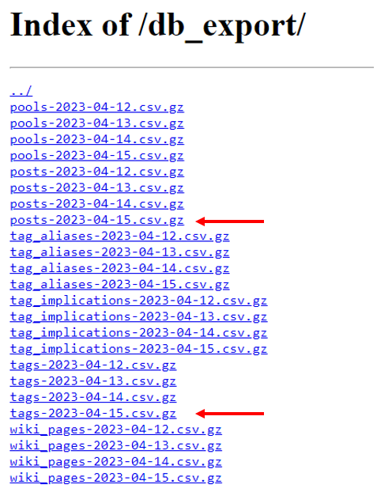

# WEBUI for e621 Posts Downloader


##### Original Backend development project: https://github.com/pikaflufftuft/pikaft-e621-posts-downloader

## Features

- User friendly UI
- Easy to load, edit, & create new json configs
- Advanced configuration tabs
- Easy to run directly from the UI
- Easy to run multiple configs in batch runs
- Gallery preview w/ search capability
- Easy to use Tag Editor
- Tag statistics tab
- Download relevant repos & pre-trained model/s tab

## Newest Features

#### (JUST ADDED! (04-26-2023))

- Download relevant repos & pre-trained model/s tab

#### (04-23-2023)

- Progress Bars for auto-config apply button for post-processing all images
- A feature that tracks changes for images that are downloaded and saves them to a file; additionally tracking tag/s added removed to images as well as the images themselves being removed. The file generated can be used to instantly filter images & tags to match those exact changes later on. (runs automatically after the backend script finishes running)
- A button, search bar, and selection box for appending and/or prepending text/tags based on a searched tag
- A button for replacing text/tags automatically with provided text files
- A button for removing images individually and/or batched
- A button to apply the persist the changes to Disk
--- additional notes have been added to the headers of some of the Tabs as well

### Features (later)

- Tag auto-completion

## Requirements
python 3.8+

clone repository
```
git clone https://github.com/x-CK-x/pikaft-e621-posts-downloader.git
```
```
cd pikaft-e621-posts-downloader
pip install -r requirements.txt
```

#### aria2
This downloader uses aria2 for fast downloading.
```
sudo apt-get install aria2
```
#### other system installs
- unzip for the (optionally) downloaded zip files
```
supo apt-get install unzip
```

For Windows, install the aria2 build https://github.com/aria2/aria2/releases/ Add aria2 in your environment variable paths

## How to use

#### Run the Web-User Interface
```
python webui.py
python webui.py --listen 127.0.0.1 --server_port 7860 --inbrowser --share
python webui.py --listen 127.0.0.1 --server_port 7860 --inbrowser --share --username NAME --password PASS
```

## Additional Information

# Important:

## DB export error workaround:
If you get an error saying,
> https://e621.net/db_export/' returned non-zero exit status 22

It could be caused by the e621 website doing a connection check, so automatically downloading the db export throws an error. You need to download the posts and tags .gz files manually. You only need to download one "posts" .csv.gz and one "tags" .csv.gz. I recommend downloading the latest versions.



Extract the csv files. I recommend placing them where the downloader is located. Specify the csv paths using `--postscsv` and `--tagscsv`.

Then populate the text fields manually in the GUI, step-wise reproducing the same command line approach:

For example:
- On the Run Tab, populate the `postscsv` and `tagscsv` textboxes. Then Run.
- After the downloader created the optimized parquet files, populate the `postsparquet` and `tagsparquet` textboxes. Then Run.

OR

For example:
```
python3 e621_batch_downloader.py -s settings.json --postscsv posts-2023-04-15.csv --tagscsv tags-2023-04-15.csv
```
After the downloader created the optimized parquet files, you can use those using `--postsparquet` and `--tagsparquet`.
```
python3 e621_batch_downloader.py -s settings.json --postsparquet posts-2023-04-15.parquet --tagsparquet tags-2023-04-15.parquet
```

##### General Config Tab

- set the path to the batch directory (stores downloaded data) ; creates new directory if it doesn't yet exist
- set the path to the resized images directory (stores resized data) ; creates new directory if it doesn't yet exist
- set tag seperator/delimeter
- set tag order
- set any tags to prepend succeeding the download step
- set any tags to append succeeding the download step
- set the target image extension
- set tag handler for resized images
- set path to json file if not already specified
- (optional) create new config option whenever clicking "Apply & Save"
- (optional) set json file from dropdown menu
- (optional) load json config from file

##### Stats Config Tab

- set all stats requirements of images on the image-board website

##### Checkbox Config Tab

- configure settings for data collection, downloading, & resizing

##### Required Tags Config Tab

- manually provide or specify a file with the tags to include
- (to remove tags) check tags and press remove ; all non-removed tags will be included in data collection

##### Blacklist Tags Config Tab

- manually provide or specify a file with the tags to exclude
- (to remove tags) check tags and press remove ; all non-removed tags will be included in data collection

##### Additional Components Config Tab

- set paths for the different types of downloaded data
- (optional) set path to file with image IDs to include and/or exclude
- set path to save all searched images IDs to
- (optional) set path to file with all negative tags

##### Run Tab

- set cpu usage
- (optional) set to complete all phases of the download per batch
- (optional) keep db data
- (optional) cache posts file if multiple batches
- (optional) path to posts/tags files
- (optional if using linux) path to aria2c program
- run button
- a dropdown menu to set multiple configs to run as a batch

##### Image Preview Tab

- set file type to view
- search downloaded gallery with multiple file type options (positive & negative tags ONLY)
- easily add tags into respective categories for single images, as well as images of any type (including images that have been searched)

##### Data Stats Tab

- set the method type to run & meta tag category

#### File and Folder Paths
Whether it's a file or a folder path, you can specify either a relative path or an absolute path. Each parameter that is a relative path uses the specified parent folder in each batch accordingly.

##### Default folder directory tree
```
base_folder/
├─ batch_folder/
│  ├─ downloaded_posts_folder/
│  │  ├─ png_folder/
│  │  ├─ jpg_folder/
│  │  ├─ gif_folder/
│  │  ├─ webm_folder/
│  │  ├─ swf_folder/
│  ├─ resized_img_folder/
│  ├─ tag_count_list_folder/
│  │  ├─ tags.csv
│  │  ├─ tag_category.csv
│  ├─ save_searched_list_path.txt
```
Any file path parameter that are empty will use the default path.

Files/folders that use the same path are merged, not overwritten. For example, using the same path for save_searched_list_path at every batch will result in a combined searched list of every batch in one .txt file.

#### e621 tag categories:    
* general (`anthro`, `female`, `solo`, ...)
* artist (`tom_fischbach`, `unknown_artist`, ...)
* copyright (`nintendo`, `pokemon`, `disney`, ...)
* character (`loona_(helluva_boss)`, `legoshi_(beastars)`, ...)
* species (`canine`, `fox`, `dragon`, ...)
* invalid (`spooky_(disambiguation)`, ...)
* meta (`hi_res`, `digital_media_(artwork)`, ...)
* lore (`trans_(lore)`, `male_(lore)`, ...)
* rating (`explicit`, `questionable`, `safe`) (rating tags are technically not e621 tags)

### Notes
* When downloading, if the file already exists, it is skipped, unless, the file exists but was modified, it will download and the modified file will be renamed. Hence, I recommend not setting `delete_original` to `true` if you plan redownloading using the same destination folder.
* When resizing, when `resized_img_folder` uses a different folder from the source folder, if the file in the destination folder already exists, it is skipped. It does not check if the already existing file has the specified `min_short_side`.
* When running a new batch using the same save directories for tag files, tag count folders, and save_searched_list, tag files, tag count csvs, and save_searched_lists will be overwritten.

### Please see the original backend development project for more information: https://github.com/pikaflufftuft/pikaft-e621-posts-downloader

## License

MIT

## Usage conditions
By using this downloader, the user agrees that the author is not liable for any misuse of this downloader. This downloader is open-source and free to use.

THE SOFTWARE IS PROVIDED "AS IS", WITHOUT WARRANTY OF ANY KIND, EXPRESS OR
IMPLIED, INCLUDING BUT NOT LIMITED TO THE WARRANTIES OF MERCHANTABILITY,
FITNESS FOR A PARTICULAR PURPOSE AND NONINFRINGEMENT. IN NO EVENT SHALL THE
AUTHORS OR COPYRIGHT HOLDERS BE LIABLE FOR ANY CLAIM, DAMAGES OR OTHER
LIABILITY, WHETHER IN AN ACTION OF CONTRACT, TORT OR OTHERWISE, ARISING FROM,
OUT OF OR IN CONNECTION WITH THE SOFTWARE OR THE USE OR OTHER DEALINGS IN THE
SOFTWARE.
